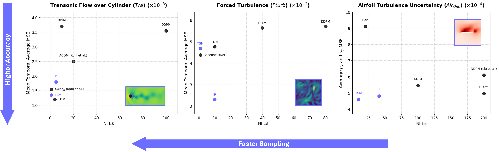

# Improved Sampling Of Diffusion Models In Fluid Dynamics With Tweedie's Formula

This repository implements the methods from our paper, ["Improved Sampling of Diffusion Models in Fluid Dynamics With Tweedie's Formula,"](https://openreview.net/forum?id=0FbzC7B9xI) by Youssef Shehata, Benjamin Holzschuh, and Nils Thuerey, presented at ICLR 2025.

<p align="center">
  
</p>


<strong>Abstract</strong>

State-of-the-art Denoising Diffusion Probabilistic Models (DDPMs) rely on an expensive sampling process with a large Number of Function Evaluations (NFEs) to provide high-fidelity predictions. This computational bottleneck renders diffusion models less appealing as surrogates for the spatio-temporal prediction of physics-based problems with long rollout horizons. We propose Truncated Sampling Models, enabling single-step and few-step sampling with elevated fidelity by simple truncation of the diffusion process, reducing the gap between DDPMs and deterministic single-step approaches. We also introduce a novel approach, Iterative Refinement, to sample pre-trained DDPMs by reformulating the generative process as a refinement process with few sampling steps. Both proposed methods enable significant improvements in accuracy compared to DDPMs, DDIMs, and EDMs with NFEs ≤ 10 on a diverse set of experiments, including incompressible and compressible turbulent flow and airfoil flow uncertainty simulations. Our proposed methods provide stable predictions for long rollout horizons in time-dependent problems and are able to learn all modes of the data distribution in steady-state problems with high uncertainty.

## Installation

Install all required packages by running the command:

```bash
conda env create -f fast_dms.yml
conda activate fast_dms
```

## How to run

In the root folder, the following command is used to start the training or sampling procedure of any model: 

```bash
python main.py -config configs/configs_dir/name_of_configs_file.ini
```

## Reproducing sampling results

Pre-trained models will be released soon.

The following table summarizes all configuration files that can recreate the results for all test cases as presented in Tables 1 and 2.

|Model name|Configuration file         |
|----------|-----------------------------|
|**Tra**       |                             |
|DDPM T100 |configs/configs_sampling/tra_DDPM.ini|
|EDM |configs/configs_sampling/tra_EDM.ini|
|DDIM T20  |configs/configs_sampling/tra_DDIM.ini|
|IR T100 - N $\gamma_1$|configs/configs_sampling/tra_IR.ini|
|TSM T100 s =1|configs/configs_sampling/tra_TSM.ini|
|**Fturb**     |                             |
|DDPM T80  |configs/configs_sampling/fturb_DDPM.ini|
|EDM  |configs/configs_sampling/fturb_EDM.ini|
|DDIM T80  |configs/configs_sampling/fturb_DDIM.ini|
|IR T80 - N|configs/configs_sampling/fturb_IR.ini|
|TSM T100 s =1|configs/configs_sampling/fturb_TSM.ini|
|**Air One**   |                             |
|DDPM T200 |configs/configs_sampling/air_one_DDPM.ini|
|EDM |configs/configs_sampling/air_one_EDM.ini|
|DDIM T200 |configs/configs_sampling/air_one_DDIM.ini|
|IR T200 - s=0.6 $\gamma_5$|configs/configs_sampling/air_one_IR.ini|
|TSM T100 s=0.9|configs/configs_sampling/air_one_TSM.ini|
|**Air Multi** |                             |
|DDPM T100 |configs/configs_sampling/air_multi_DDPM.ini|
|EDM |configs/configs_sampling/air_multi_EDM.ini|
|DDIM T100 |configs/configs_sampling/air_multi_DDIM.ini|
|IR T100 - s=0.6 $\gamma_5$|configs/configs_sampling/air_multi_IR.ini|
|TSM T100 s=0.75|configs/configs_sampling/air_multi_TSM.ini|


## Training

The following list summarizes all configuration files to train models for all test cases.

- **Tra**: `configs/configs_training/tra.ini` and `configs/configs_training/tra_EDM.ini`
- **Fturb**: `configs/configs_training/fturb.ini`, `configs/configs_training/fturb_baseline.ini`, and `configs/configs_training/fturb_EDM.ini`
- **Air One**: `configs/configs_training/air_one.ini` and `configs/configs_training/air_one_EDM.ini`
- **Air Multi**: `configs/configs_training/air_multi.ini` and `configs/configs_training/air_multi_EDM.ini`

## Obtaining the datasets

The datasets will be released soon. Instead, you can re-create the training and test datasets for the different experiments:

### Tra test case

The dataset for this test case can be downloaded (file `128_tra.zip`, 12.1GB) from the authors' original [GitHub link](https://github.com/tum-pbs/autoreg-pde-diffusion/tree/main) and should be saved to `datasets/128_tra`. The dataset includes each channel (velocity, pressure, and density) and frame in a separate file. Combine these files once for faster loading by running the following:

```bash
python datasets/tra_combine.py
```

This will output the training dataset with the following files:

* `128_tra_velocity_train.npy` with shape `(33, 1001, 2, 128, 64)`.
* `128_tra_pressure_train.npy` with shape `(33, 1001, 1, 128, 64)`.
* `128_tra_density_train.npy` with shape `(33, 1001, 1, 128, 64)`.
* `128_tra_density_train.npy` with shape `(33, 1001, 1, 128, 64)`.
* `128_tra_mach_number_train.npy` with shape `(33,)`.

In `datasets/tra_combine.py`, change `sim_type` from `'train'` to `'test'` and run the command above again to perform the same combination for the test dataset to output the following files:

* `128_tra_velocity_test.npy` with shape `(6, 1001, 2, 128, 64)`.
* `128_tra_pressure_test.npy` with shape `(6, 1001, 1, 128, 64)`.
* `128_tra_density_test.npy` with shape `(6, 1001, 1, 128, 64)`.
* `128_tra_mach_number_test.npy` with shape `(6,)`.

All combined files should be stored at `/datasets/128_tra_single` afterwards.

```
@article{kohl2023_acdm,
  author = {Georg Kohl and Li{-}Wei Chen and Nils Thuerey},
  title = {Benchmarking Autoregressive Conditional Diffusion Models for Turbulent Flow Simulation},
  journal = {arXiv},
  year = {2023},
  eprint = {2309.01745},
  primaryclass = {cs},
  publisher = {arXiv},
  url = {https://doi.org/10.48550/arXiv.2309.01745},
  doi = {10.48550/arXiv.2309.01745},
  archiveprefix = {arxiv}
}
```

### Fturb test case

First, if not already installed, install phiflow by running:

```bash
pip install --upgrade phiflow
```
Then, from the root folder, run (better on a device with available GPU):

```bash
python datasets/fturb_generation.py
```

This will generate the entire dataset in 128x128 reslution and with each frame (of 2 velocity channels) saved to one file. Afterwards, downsample to 64x64 and save the files in combined formats for faster loading. All files should be stored at `/datasets/`.

For the training dataset, each of the following should have the shape `(240, 51, 2, 64, 64)` and with file names:

* `kolmogorov_res64_cfl0.7_re200_seeds0-599.npy`
* `kolmogorov_res64_cfl0.7_re1000_seeds0-599.npy`
* `kolmogorov_res64_cfl0.7_re2500_seeds0-599.npy`
* `kolmogorov_res64_cfl0.7_re4000_seeds0-599.npy`

For the testing dataset, each of the following should have the shape `(2, 51, 2, 64, 64)` and with file names:

* `kolmogorov_res64_cfl0.7_re100_seeds0-99.npy`
* `kolmogorov_res64_cfl0.7_re1750_seeds100-199.npy`
* `kolmogorov_res64_cfl0.7_re5000_seeds200-299.npy`


### Air test case

The dataset for this test case can be obtained from the authors' original [GitHub link.](https://github.com/tum-pbs/Diffusion-based-Flow-Prediction/tree/main)

For **Air One**, the downloaded files show be saved at `datasets/airfoil/1_parameter`. For **Air Multi**, save the data at `datasets/airfoil`.

```
@inproceedings{liu2023dbfp,
    title={Uncertainty-aware Surrogate Models for Airfoil Flow Simulations with Denoising Diffusion Probabilistic Models}, 
    author={Qiang Liu and Nils Thuerey},
    year={2023},
    booktitle={arXiv 2312.05320},
    url={https://github.com/tum-pbs/Diffusion-based-Flow-Prediction/}
}
```

---

## Citation

If you find this work useful, please cite our paper: 

```
@inproceedings{
shehata2025improved,
title={Improved Sampling Of Diffusion Models In Fluid Dynamics With Tweedie's Formula},
author={Youssef Shehata and Benjamin Holzschuh and Nils Thuerey},
booktitle={The Thirteenth International Conference on Learning Representations},
year={2025},
url={https://openreview.net/forum?id=0FbzC7B9xI}
}
```

 We welcome contributions and feedback!